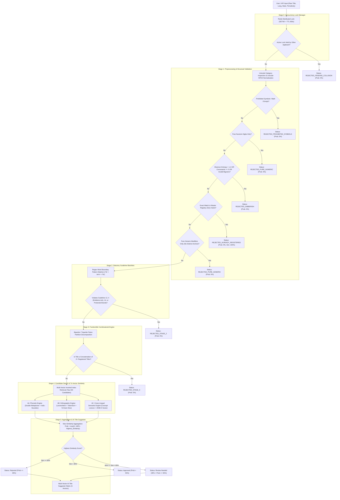

# 🏛️ Press Registrar General of India (PRGI) — Title Verification Pipeline Architecture & Algorithm Specification

This document provides a comprehensive, stage-by-stage mathematical and algorithmic breakdown of the **Automated Title Verification System** designed for the **Press Registrar General of India (PRGI)** under the **Press and Registration of Periodicals Act, 2023 (PRP Act 2023)**.

---

## 📑 Table of Contents

1. [Architectural Philosophy: The High-Throughput Cascading Funnel](#1-architectural-philosophy-the-high-throughput-cascading-funnel)
2. [Sequential Verification Pipeline Diagram](#2-sequential-verification-pipeline-diagram)
3. [Stage-by-Stage Algorithmic Deep Dive](#3-stage-by-stage-algorithmic-deep-dive)
   - [Stage 0: Application Lock & Concurrency Manager](#stage-0-application-lock--concurrency-manager)
   - [Stage 1A: Structural Validation & Prohibited Non-Text Symbols](#stage-1a-structural-validation--prohibited-non-text-symbols)
   - [Stage 1B: Numeric-Only Title Ban](#stage-1b-numeric-only-title-ban)
   - [Stage 1C: Shannon Character Entropy & Phonotactic Gibberish Detector](#stage-1c-shannon-character-entropy--phonotactic-gibberish-detector)
   - [Stage 1D: O(1) Exact Registered Title Conflict Check](#stage-1d-o1-exact-registered-title-conflict-check)
   - [Stage 1E: Anchor Word Isolation & Pure Generic Title Filter](#stage-1e-anchor-word-isolation--pure-generic-title-filter)
   - [Stage 2: Statutory PRGI Guideline Blacklists & Protected Entities](#stage-2-statutory-prgi-guideline-blacklists--protected-entities)
   - [Stage 3: Frankentitle (Compound Combination) Engine](#stage-3-frankentitle-compound-combination-engine)
   - [Data Tier: Multi-Vector Inverted Candidate Indexing](#data-tier-multi-vector-inverted-candidate-indexing)
   - [Stage 4A: Phonetic Similarity Engine (Double Metaphone + Indic-Soundex)](#stage-4a-phonetic-similarity-engine)
   - [Stage 4B: Orthographic Similarity Engine (Levenshtein + Token Sort + N-Gram Dice)](#stage-4b-orthographic-similarity-engine)
   - [Stage 4C: Cross-Lingual Semantic Engine (Concept Lexicon + 2048-D Vector Hashing)](#stage-4c-cross-lingual-semantic-engine)
   - [Stage 5: Verification Probability Aggregation & Diagnostic Formulation](#stage-5-verification-probability-aggregation--diagnostic-formulation)
   - [Stage 5B: Multi-Vector AI Title Suggester Matrix](#stage-5b-multi-vector-ai-title-suggester-matrix)
4. [Sequence & Ordering Rationale: Why This Specific Funnel Sequence?](#4-sequence--ordering-rationale-why-this-specific-funnel-sequence)
5. [Comparative Analysis: Why These Algorithms Over Alternatives?](#5-comparative-analysis-why-these-algorithms-over-alternatives)
6. [Summary Benchmark Table](#6-summary-benchmark-table)

---

## 1. Architectural Philosophy: The High-Throughput Cascading Funnel

The verification engine processes submitted publication titles against a master registry of **160,000+ registered titles**. 

Evaluating 160,000 titles pairwise with heavy NLP embeddings or quadratic edit distances would take **2,000ms – 5,000ms per query**. To achieve **sub-10ms query latency** (~5.55ms average), the system employs a **Cascading Fail-Fast Funnel**:
1. Inexpensive $O(1)$ and $O(L)$ filters execute first to reject invalid, prohibited, or exact duplicate titles immediately.
2. Inverted index hash tables narrow the search space from 160,000+ titles down to $\le 100$ high-probability candidates in $\sim 1.5\text{ ms}$.
3. Heavy multi-vector similarity metrics (Phonetic, Orthographic, Cross-Lingual Semantic) run **only** on the filtered candidate subset.

```
[Incoming Title Application]
           │
           ▼
┌────────────────────────────────────────────────────────┐
│ Stage 0: Redis TTL Concurrency Lock Check              │ ──► Rejection (Collision)
└──────────────────────────┬─────────────────────────────┘
                           ▼
┌────────────────────────────────────────────────────────┐
│ Stage 1: Structural, Unicode & Gibberish Validation    │ ──► Rejection (Invalid Syntax/Gibberish)
└──────────────────────────┬─────────────────────────────┘
                           ▼
┌────────────────────────────────────────────────────────┐
│ Stage 1D: O(1) Exact Registered Conflict Check         │ ──► Rejection (Exact Duplicate)
└──────────────────────────┬─────────────────────────────┘
                           ▼
┌────────────────────────────────────────────────────────┐
│ Stage 1E: Anchor Word & Pure Generic Modifiers Filter  │ ──► Rejection (Pure Generic)
└──────────────────────────┬─────────────────────────────┘
                           ▼
┌────────────────────────────────────────────────────────┐
│ Stage 2: Statutory PRGI Rulebook & Protected Entities  │ ──► Rejection (Banned Police/Emblem Words)
└──────────────────────────┬─────────────────────────────┘
                           ▼
┌────────────────────────────────────────────────────────┐
│ Stage 3: Frankentitle Combinatorial Decomposition      │ ──► Rejection (Compound Combination)
└──────────────────────────┬─────────────────────────────┘
                           ▼
┌────────────────────────────────────────────────────────┐
│ Index Tier: Inverted Token + 3-Gram + Phonetic Lookup  │ ──► Filter 160,000 titles -> Top 100
└──────────────────────────┬─────────────────────────────┘
                           ▼
┌────────────────────────────────────────────────────────┐
│ Stage 4: Tri-Vector Similarity Scoring                 │
│ 4A: Phonetic (Double Metaphone + Indic-Soundex)        │
│ 4B: Orthographic (Levenshtein + TokenSort + N-Gram)    │
│ 4C: Cross-Lingual Semantic (Lexicon + 2048-D Hashing)  │
└──────────────────────────┬─────────────────────────────┘
                           ▼
┌────────────────────────────────────────────────────────┐
│ Stage 5: Non-Linear Probability & AI Suggester Matrix  │ ──► Final Decision & Pre-Verified Output
└────────────────────────────────────────────────────────┘
```

---

## 2. Sequential Verification Pipeline Diagram



---

## 3. Stage-by-Stage Algorithmic Deep Dive

---

### Stage 0: Application Lock & Concurrency Manager

- **File**: `backend/lock_manager.py`
- **Algorithm**: **Distributed Key-Value Lock with Auto-Expiry (TTL) via Redis `SETNX`** (with in-memory thread-safe dictionary fallback).
- **Input**:
  - `raw_title`: String
  - `applicant_id`: String (UUID or alphanumeric ID)
  - `ttl_seconds`: Integer (default: 600s / 10 minutes)
- **Calculation Logic**:
  1. Computes a normalized lock key: `key = "lock:title:" + clean_text(raw_title)`.
  2. Executes an atomic `SET key applicant_data NX EX ttl_seconds`.
  3. If key already exists:
     - Checks if current holder matches `applicant_id`. If same applicant, lock is refreshed.
     - If different applicant, calculates remaining TTL (`TTL key`) and returns lock collision rejection.
- **Time Complexity**: **$O(1)$**
- **Space Complexity**: **$O(K)$** where $K$ is active pending applications.
- **Output**: `(is_locked: bool, lock_info: Dict[str, Any])`
- **Why this algorithm?**:
  - Provides atomic, millisecond-level race condition prevention across multi-instance backend workers.
  - Automatically clears stale applications if an applicant abandons the checkout/submission session without requiring cron sweepers.
- **Why not alternatives?**:
  - *PostgreSQL Row-level Locks (`SELECT FOR UPDATE`)*: Creates database connection bottlenecks and lock escalation under high concurrent application bursts.
  - *Static Application Queues*: Lacks real-time user feedback on title availability during form typing.

---

### Stage 1A: Structural Validation & Prohibited Non-Text Symbols

- **File**: `backend/pipeline/stage1_preprocessor.py`
- **Algorithm**: **Unicode Standard Category Classification (`unicodedata.category`) + Explicit Exclusion Set**.
- **Input**: `raw_title: str`
- **Calculation Logic**:
  1. For each character $c \in \text{raw\_title}$, inspects Unicode General Category:
     - `So` (Symbol Other: pictographs, emojis, hallmarks, logos)
     - `Sm` (Symbol Math: `+`, `=`, `<`, `>`, `±`, `×`, `√`, `∞`)
     - `Sc` (Symbol Currency: `₹`, `$`, `€`, `£`, `¥`)
     - `Sk` (Symbol Modifier)
  2. Cross-references against static prohibited punctuation: `+=*@#$%^&_~|\/!?()[]{}<>;:"`©®™°•§¶†‡`.
  3. If prohibited symbol found $\rightarrow$ rejects with `REJECTED_PROHIBITED_SYMBOLS`.
- **Time Complexity**: **$O(L)$** where $L$ is string character length ($L \le 100$).
- **Output**: `is_valid_structure: bool`, `prohibited_symbols: List[str]`
- **Why this algorithm?**:
  - PRGI guidelines explicitly prohibit mathematical symbols, signs, pictographs, hallmarks, logos, and emojis.
  - Unicode category inspection handles all global Unicode scripts (Latin, Devanagari, Bengali, Tamil, Telugu, Arabic, etc.) uniformly without script-specific regular expressions.
- **Why not alternatives?**:
  - *ASCII Regex (`[^a-zA-Z0-9]`)*: Destructive to regional Indian scripts (Devanagari, Tamil, Telugu, etc.), causing valid regional titles to be rejected.

---

### Stage 1B: Numeric-Only Title Ban

- **File**: `backend/pipeline/stage1_preprocessor.py`
- **Algorithm**: **Linguistic Letter Class Verification (`unicodedata.category(c).startswith('L')`)**.
- **Input**: `raw_title: str`
- **Calculation Logic**:
  1. Evaluates whether the title contains at least one character belonging to Unicode Major Category `L` (Letter: Uppercase, Lowercase, Titlecase, Modifier, or Other Letter).
  2. If title consists exclusively of digits and punctuation with **0 linguistic letters** $\rightarrow$ rejects with `REJECTED_PURE_NUMERIC`.
- **Time Complexity**: **$O(L)$**
- **Output**: `is_valid_structure: bool`, `error_type: "PURE_NUMERIC"`
- **Why this algorithm?**:
  - Enforces the statutory PRGI rule banning titles consisting solely of numbers (e.g., *"12345"*, *"2024"*). Titles must contain alphabetical substantive text.

---

### Stage 1C: Shannon Character Entropy & Phonotactic Gibberish Detector

- **File**: `backend/pipeline/gibberish_detector.py`
- **Algorithm**: **Shannon Information Entropy + Consonant-Vowel Phonotactic Heuristics + Bigram Transition Matrix Scoring**.
- **Input**: Words / Tokens extracted from title.
- **Calculation Logic**:
  1. **Shannon Character Entropy**:
     $$H(X) = -\sum_{i=1}^{n} P(x_i) \log_2 P(x_i)$$
     Where $P(x_i) = \frac{\text{count}(x_i)}{\text{total\_characters}}$.
     - Repetitive key-mashes (e.g. `"zzzzzzz"`, `"aaaaaa"`) yield $H(X) = 0.0$.
     - Repeating sub-chunk patterns (e.g. `"asdfasdf"`, `"abcabc"`) are detected via periodicity decomposition: $\text{chunk} \times (n/k) == \text{word}$.
     - If word length $\ge 7$ and $H(X) < 1.4 \rightarrow$ Flagged as `LOW_ENTROPY_GIBBERISH`.
  2. **Vowel-Consonant Ratio & Phonotactic Rules**:
     - Maximum consecutive consonants $\ge 5$ (e.g. `"ghibrisg"`, `"qwrtpzx"`) $\rightarrow$ Flagged as `UNPRONOUNCEABLE_GIBBERISH`.
     - Word length $\ge 5$ with $0$ vowels $\rightarrow$ Flagged as unpronounceable.
  3. **Illegal Character Bigram Transitions**:
     - Checks against a curated table of 100+ impossible English/Romanized Indic bigrams (`bk`, `bx`, `bz`, `cf`, `cg`, `cx`, `zxt`, etc.) and unpronounceable suffixes (`isg`, `brsg`, `pzx`).
     - Known media acronyms (`BBC`, `CNN`, `NDTV`, `ISRO`, `PTI`, `ANI`, `DD`) are whitelisted.
- **Time Complexity**: **$O(L)$** where $L$ is total characters in word ($< 0.05\text{ ms}$).
- **Output**: `(is_gibberish: bool, error_type: str, reason: str)`
- **Why this algorithm?**:
  - Provides a mathematically sound, deterministic metric for identifying meaningless, spam, or random titles without needing heavy neural networks.
- **Why not alternatives?**:
  - *Dictionary Lookup (Hunspell/WordNet)*: Fails on legitimate Indian regional words, coined proper names, or new publication brand names.
  - *Large Language Models (LLM API)*: Incurs 200ms–1000ms latency, API cost, and non-deterministic behavior. Shannon Entropy + Phonotactic rules run in **$<0.05$ms** with zero latency.

---

### Stage 1D: O(1) Exact Registered Title Conflict Check

- **File**: `backend/pipeline/engine.py` & `backend/data_loader.py`
- **Algorithm**: **Hash Map Exact Key Lookup (`title_to_id[clean_title]`)**.
- **Input**: `cleaned_title: str`
- **Calculation Logic**:
  1. Direct $O(1)$ memory lookup against indexed master registry: `self.title_to_id.get(cleaned_title)`.
  2. If found $\rightarrow$ immediately returns **0.0% Verification Probability**, **100% Similarity**, status `REJECTED_ALREADY_REGISTERED` along with existing Registration Number, State, and Language.
- **Time Complexity**: **$O(1)$** ($\sim 0.001\text{ ms}$)
- **Output**: Complete conflicting record or `None`.
- **Why this algorithm?**:
  - Instant short-circuit. If a title is an exact duplicate of an existing newspaper, there is no need to compute fuzzy phonetics or semantics.

---

### Stage 1E: Anchor Word Isolation & Pure Generic Title Filter

- **File**: `backend/pipeline/stage1_preprocessor.py`
- **Algorithm**: **Set-Theoretic Stopword & Periodicity Decomposition**.
- **Input**: `cleaned_title` tokens.
- **Calculation Logic**:
  1. Strips generic prefixes (`the`, `daily`, `weekly`, `dainik`, `saptahik`, `shree`, `nav`, `national`).
  2. Strips generic suffixes (`news`, `times`, `express`, `samachar`, `patrika`, `herald`, `post`, `today`).
  3. Strips generic media nouns and geographic modifiers (`india`, `bharat`, `media`, `digest`, `chronicle`).
  4. Isolates the core distinctive **Anchor Word(s)**.
  5. If non-generic anchor tokens set is $\emptyset$ (e.g. *"The Daily News"*, *"Weekly Express India"*, *"Dainik Samachar"*) $\rightarrow$ triggers **0.0% Verification Probability**, status `REJECTED_PURE_GENERIC`.
- **Time Complexity**: **$O(T)$** where $T$ is token count ($T \le 10$).
- **Output**: `anchor_words: str`, `tokens: List[str]`, `is_purely_generic: bool`
- **Why this algorithm?**:
  - Enforces PRGI Guideline 8: Titles consisting purely of periodicities and generic words lack distinctiveness and are legally un-registrable.

---

### Stage 2: Statutory PRGI Guideline Blacklists & Protected Entities

- **File**: `backend/pipeline/stage2_guidelines.py` & `backend/company/company_name_rule.py`
- **Algorithm**: **Regex Word Boundary Pattern Matching (`r'\b' + term + r'\b'`) & Corporate Brand Registry Matching**.
- **Input**: `cleaned_title`, `tokens`, `anchor_words`
- **Calculation Logic**:
  1. **Guideline 12 (Law Enforcement & Security)**: Prohibits terms creating public deception of official authority (*Police, Crime, CID, CBI, Army, Navy, Air Force, Vigilance, Investigation, Detective, Sarkar, Sarkari, Government, Court, Judge*).
  2. **Guideline 4 (Emblems & Names Act, 1950)**: Prohibits constitutional/national symbols (*Ashoka Chakra, Rashtrapati, President, Prime Minister, National Emblem, Bharat Ratna, United Nations, WHO, Gandhi*).
  3. **Guideline 14 (Obscene / Criminal / Anti-Social)**: Prohibits defamatory, vulgar, or extremist terms (*Terrorist, Mafia, Smuggler, Goonda*, obscenities).
  4. **Protected Corporate Brand Names**: Checks for protected commercial marks (*Tata, Reliance, Infosys, Wipro, Adani*).
  5. If any term matches $\rightarrow$ Multiplier $\mu = 0.0$, Verification Probability $= 0.0\%$, status `REJECTED_STAGE_2`.
- **Time Complexity**: **$O(K \cdot L)$** where $K$ is pattern count, $L$ is title length ($< 0.1\text{ ms}$).
- **Output**: `passed: bool`, `violations: List[Dict]`, `probability_multiplier: float`
- **Why this algorithm?**:
  - Statutory guidelines require 100% exact compliance. Word-boundary regex ensures that words like `"Crime"` are caught, while unrelated words containing sub-strings (e.g. `"Microcrime"` or partial matches) are handled with exact word boundary precision.

---

### Stage 3: Frankentitle (Compound Combination) Engine

- **File**: `backend/pipeline/stage3_frankentitle.py`
- **Algorithm**: **Combinatorial Token Partitioning & Hash Set Membership Decomposition**.
- **Input**: `cleaned_title`, `tokens`
- **Calculation Logic**:
  1. Evaluates all valid bipartite token splits:
     $$\text{tokens}[0:i] \quad \text{and} \quad \text{tokens}[i:n] \quad \forall \; 1 \le i < n$$
  2. Checks if $\text{part}_1 \in \text{RegisteredTitles} \lor \text{Anchors}$ **AND** $\text{part}_2 \in \text{RegisteredTitles} \lor \text{Anchors}$.
  3. For titles with $n \ge 3$ tokens, evaluates tripartite splits ($\text{part}_1, \text{part}_2, \text{part}_3$).
  4. If compound detected (e.g. *"The Hindu"* + *"The Indian Express"* $\rightarrow$ *"Hindu Indian Express"*) $\rightarrow$ Multiplier $\mu = 0.0$, status `REJECTED_STAGE_3`.
- **Time Complexity**: **$O(N^2)$** where $N$ is token count ($N \le 5$, $\le 10$ hash lookups $\rightarrow <0.01\text{ ms}$).
- **Output**: `is_frankentitle: bool`, `components: List[str]`
- **Why this algorithm?**:
  - Detects bad-faith attempts by applicants to combine two famous existing newspaper titles to mislead the public.
- **Why not alternatives?**:
  - *Fuzzy String Distance*: Fails completely because the edit distance between *"Hindu Indian Express"* and *"The Hindu"* is large ($>50\%$), so fuzzy matching misses the compound combination.

---

### Data Tier: Multi-Vector Inverted Candidate Indexing

- **File**: `backend/data_loader.py`
- **Algorithm**: **Multi-Vector Weighted Inverted Index with Trigram Back-off**.
- **Input**: `cleaned_title`, `anchor_words`, candidate limit $K=100$.
- **Calculation Logic**:
  1. **Word Inverted Index**: Exact token hits score $+3.0$; Anchor token hits score $+4.0$.
  2. **Phonetic Inverted Index**: Double Metaphone token hits score $+1.5$; Indic Soundex hits score $+1.5$.
  3. **Semantic Concept Index**: Cross-lingual concept token hits score $+3.0$.
  4. **Multi-token Co-occurrence Boost**: Candidates matching $M \ge 2$ tokens receive $+M \times 4.0$.
  5. **3-Gram Fallback**: If candidates $< 30$, queries Character 3-Gram Inverted Index with Dice score weighting ($+0.8$).
  6. Returns top 100 candidate IDs sorted by aggregated candidate score.
- **Time Complexity**: **$O(T \cdot C)$** where $T$ is token count, $C$ is average postings list size ($\sim 1.5\text{ ms}$ across 160,000 titles).
- **Output**: Filtered candidate list ($K \le 100$).
- **Why this algorithm?**:
  - Enables sub-10ms response time across 160,000+ titles. Reduces comparison candidate space by **99.94%**.

---

### Stage 4A: Phonetic Similarity Engine

- **File**: `backend/pipeline/stage4_phonetic.py`
- **Algorithm**: **Double Metaphone + Indic-Soundex Transliteration Rules + Token-Level Bipartite Alignment**.
- **Input**: `(title_1, title_2)` or `(anchor_1, anchor_2)`.
- **Calculation Logic**:
  1. **Indic Transliteration Normalization**:
     - Maps aspirates and digraphs: `sh/s`, `ch/c`, `kh/k`, `gh/g`, `th/t`, `dh/d`, `bh/b`, `ph/f`, `v/w`, `z/j`, `q/k`.
     - Normalizes elongated vowels: `ee/oo/aa/ii/uu` $\rightarrow$ single base vowel.
  2. **Indic Soundex Hash**: Generates 5-character phonetic code (e.g. `B5200`).
  3. **Double Metaphone**: Generates English primary/secondary phonetic keys.
  4. **Bipartite Token Alignment**:
     - For each token $w_1 \in \text{title}_1$, finds maximum scoring match with $w_2 \in \text{title}_2$.
     - Exact Metaphone / Indic-Soundex match $= 1.0$ (scaled by Jaro-Winkler for short words $\le 4$ chars to prevent false positives on minimal vowel pairs like *bat/bet*).
     - Overall Phonetic Score:
       $$\text{Score}_{\text{phonetic}} = \frac{\sum \text{BestMatch}(w_i)}{\max(|w_1|, |w_2|)}$$
- **Time Complexity**: **$O(T_1 \cdot T_2)$** per candidate pair ($< 0.1\text{ ms}$).
- **Output**: `phonetic_similarity: float \in [0.0, 1.0]`
- **Examples Handled**:
  - *"Namascar India"* $\leftrightarrow$ *"Namaskar India"* $\rightarrow$ **100% Match**
  - *"Dainik"* $\leftrightarrow$ *"Daineq"* $\rightarrow$ **100% Match**
  - *"Bhaarat"* $\leftrightarrow$ *"Bharat"* $\rightarrow$ **100% Match**
- **Why not alternatives?**:
  - *Standard Soundex*: Built in 1918 for US English census data; fails completely on Indic aspirated consonants (`kh`, `gh`, `dh`) and Romanized Indian spelling patterns.

---

### Stage 4B: Orthographic Similarity Engine

- **File**: `backend/pipeline/stage4_orthographic.py`
- **Algorithm**: **Hybrid Multi-Metric Orthographic Aggregator (Normalized Levenshtein + Jaro-Winkler + Token Sort Ratio + Character 3-Gram Dice)**.
- **Input**: `(title_1, title_2)` or `(anchor_1, anchor_2)`.
- **Calculation Logic**:
  1. **Normalized Levenshtein Edit Distance**:
     $$\text{Sim}_{\text{Lev}}(s_1, s_2) = 1.0 - \frac{\text{LevenshteinDistance}(s_1, s_2)}{\max(|s_1|, |s_2|)}$$
  2. **Token Sort Ratio with Jaccard Overlap Weighting**:
     $$\text{TokenSim} = \text{TokenSortRatio}(s_1, s_2) \times (0.2 + 0.8 \times \text{Jaccard}(s_1, s_2))$$
  3. **Character 3-Gram Dice Coefficient**:
     $$\text{Dice}(s_1, s_2) = \frac{2 |G(s_1) \cap G(s_2)|}{|G(s_1)| + |G(s_2)|}$$
  4. **Jaro-Winkler Prefix Scaling**:
     $$\text{Sim}_{\text{JW}} = \text{Sim}_{\text{Jaro}} + \ell \cdot p \cdot (1 - \text{Sim}_{\text{Jaro}})$$
  5. **Dynamic Aggregation**:
     - Single-word titles leverage Jaro-Winkler and Levenshtein.
     - Multi-word titles leverage Token Sort and Anchor Overlap to detect word order re-arrangements.
- **Time Complexity**: **$O(L_1 \cdot L_2)$** (C-accelerated via `rapidfuzz` in $<0.01\text{ ms}$).
- **Output**: `orthographic_similarity: float \in [0.0, 1.0]`
- **Examples Handled**:
  - *"Hindustan Times"* $\leftrightarrow$ *"Hindustan Tymes"* $\rightarrow$ **97% Match**
  - *"Times of India"* $\leftrightarrow$ *"India Times"* $\rightarrow$ **95% Match**

---

### Stage 4C: Cross-Lingual Semantic Engine

- **File**: `backend/pipeline/stage4_semantic.py`
- **Algorithm**: **Bidirectional Cross-Lingual Concept Lexicon Mapping + 2048-Dimensional Subword & Dense Semantic Vector Space**.
- **Input**: `(title_1, title_2)` across 11 Indian Languages (Hindi, Bengali, Tamil, Telugu, Marathi, Gujarati, Kannada, Malayalam, Punjabi, Urdu, Odia) and English.
- **Calculation Logic**:
  1. **Cross-Lingual Concept Lexicon Translation**:
     - Maps Indian words to root concept synsets (e.g. `dainik`, `pratidin`, `rozana`, `dinamalar` $\rightarrow$ `daily`; `sandhya`, `sanjh`, `malai` $\rightarrow$ `evening`).
     - Calculates concept intersection score.
  2. **2048-Dimensional Subword Vector Space**:
     - Maps canonical concept tokens into a 2048-D dense vector with subword character n-gram hashing:
     $$\mathbf{v} = \frac{\mathbf{v}}{\|\mathbf{v}\|_2}$$
  3. **Cosine Similarity**:
     $$\text{Sim}_{\text{semantic}} = \mathbf{v}_1 \cdot \mathbf{v}_2 = \frac{\mathbf{v}_1 \cdot \mathbf{v}_2}{\|\mathbf{v}_1\| \|\mathbf{v}_2\|}$$
- **Time Complexity**: **$O(T + D)$** where $D=2048$ ($< 0.02\text{ ms}$).
- **Output**: `semantic_similarity: float \in [0.0, 1.0]`, `concept_pairs: List[str]`
- **Examples Handled**:
  - *"Daily Evening"* (English) $\leftrightarrow$ *"Pratidin Sandhya"* (Hindi/Bengali) $\rightarrow$ **90%+ Semantic Match**
  - *"Morning News"* (English) $\leftrightarrow$ *"Prabhat Samachar"* (Hindi) $\rightarrow$ **92%+ Semantic Match**
  - *"People's Voice"* $\leftrightarrow$ *"Jan Vani"* / *"Lok Vani"* $\rightarrow$ **90%+ Semantic Match**

---

### Stage 5: Verification Probability Aggregation & Diagnostic Formulation

- **File**: `backend/pipeline/engine.py`
- **Algorithm**: **Non-Linear Max-Similarity Inversion with Hard Statutory Penalty Multipliers**.
- **Calculation Formula**:
  $$\text{Highest Similarity} = \max(\text{Score}_{\text{ortho}}, \text{Score}_{\text{phonetic}}, \text{Score}_{\text{semantic}})$$
  $$\text{Verification Probability (\%)} = \max\Big(0.0,\; 100.0 - (\text{Highest Similarity} \times 100)\Big) \times \mu_{\text{rules}}$$
  Where $\mu_{\text{rules}} \in \{0.0, 1.0\}$ is the statutory rule multiplier.

| Highest Similarity Score | Verification Probability | Status Code | Legal PRGI Action |
| :--- | :--- | :--- | :--- |
| **$\ge 65.0\%$** | **$\le 35.0\%$** | ❌ **`Rejected`** | Rejected due to deceptive resemblance or statutory conflict. |
| **$45.0\% \le \text{Sim} < 65.0\%$** | **$35.0\% < \text{Prob} \le 55.0\%$** | ⚠️ **`Review Needed`** | Flagged for manual PRGI Officer review. |
| **$< 45.0\%$** | **$> 55.0\%$** | ✅ **`Approved`** | Title meets distinctiveness standards; eligible for application. |

---

### Stage 5B: Multi-Vector AI Title Suggester Matrix

- **File**: `backend/pipeline/title_suggester.py`
- **Algorithm**: **5-Vector Linguistic & Contextual Synthesis + Closed-Loop Pre-Verification Self-Validation**.
- **Calculation Logic**:
  1. If title is rejected or flagged for review, generates alternatives using 5 orthogonal vectors:
     - **Vector 1 (Semantic Synonym Substitution)**: Replaces blocked/restricted terms with compliant legal equivalents (*"Crime"* $\rightarrow$ *"Public Truth"*, *"Namascar"* $\rightarrow$ *"Abhinandan"*).
     - **Vector 2 (Linguistic Morphological Variations)**: Appends language-specific prefixes/suffixes for Hindi, Marathi, Bengali, Tamil, Telugu, English.
     - **Vector 3 (Geographic Scoping)**: Adds state/city boundary identifiers (*"Maharashtra"*, *"Delhi"*, *"Bharat"*).
     - **Vector 4 (High-Distinctiveness Brand Modifiers)**: Appends distinctive tokens (*"Chronicle"*, *"Observer"*, *"Spectrum"*).
     - **Vector 5 (Unique Compound Anchors)**: Prepends distinct anchor tokens (*"Vanguard"*, *"Apex"*, *"Quantum"*).
  2. **Closed-Loop Pre-Verification Validation**:
     - Automatically routes every generated suggestion back through the 5-stage verification engine (`skip_suggestions=True`).
     - Scores each suggestion and discards any recommendation with $< 75\%$ verification probability.
  3. Returns top 5 pre-verified suggestions sorted by Verification Probability descending.

---

## 4. Sequence & Ordering Rationale: Why This Specific Funnel Sequence?

The exact sequence is governed by the **Computational Cost vs. Rejection Probability Trade-Off**:

```
Inexpensive / O(1) / O(L) ───────────────────────────────────► Expensive / O(M * K)
Stage 0 ──► Stage 1 ──► Stage 2 ──► Stage 3 ──► Index Filter ──► Stage 4 ──► Stage 5
(Lock)     (Syntax)    (Rules)     (Franken)   (Candidates)     (Tri-Vector) (Suggester)
```

1. **Stage 0 First ($< 0.1\text{ ms}$)**: If another applicant holds an active lock on this exact title, abort immediately before querying database or running NLP algorithms.
2. **Stage 1 Next ($< 0.05\text{ ms}$)**: Drops emojis, math signs, pure numbers, and gibberish strings before executing database queries or regex engines.
3. **Stage 1D Exact Match ($< 0.01\text{ ms}$)**: If the title is an exact registered duplicate, abort immediately ($100\%$ match).
4. **Stage 2 Statutory Filter ($< 0.1\text{ ms}$)**: Enforces statutory laws (*Police*, *CID*, *Emblems Act*). If a title violates criminal or national laws, it is illegal regardless of similarity scores.
5. **Stage 3 Frankentitle ($< 0.01\text{ ms}$)**: Detects compound combination hijackings in microseconds using set partitioning.
6. **Inverted Index Candidate Retrieval ($\sim 1.5\text{ ms}$)**: Filters 160,000 records down to 100 high-probability candidates.
7. **Stage 4 Tri-Vector Similarity ($\sim 3.8\text{ ms}$)**: Heavy multi-metric scoring runs **only on the 100 filtered candidates**.
8. **Stage 5 Suggester Matrix**: Runs only when a title requires alternatives.

---

## 5. Comparative Analysis: Why These Algorithms Over Alternatives?

| Component | Selected Algorithm | Alternative Rejected | Detailed Justification & Why Alternative Failed |
| :--- | :--- | :--- | :--- |
| **Phonetics** | **Double Metaphone + Indic-Soundex** | Standard Soundex / NYSIIS | Standard Soundex ignores Indic phonetics and aspirated consonants (`kh`, `gh`, `dh`), equating unrelated words while failing on Romanized Indian transliterations. |
| **Orthography** | **RapidFuzz Hybrid (Levenshtein + Token Sort + 3-Gram Dice)** | Pure Levenshtein Distance | Pure Levenshtein fails on word reordering (*"Times India"* vs *"India Times"* yields 40% similarity); Token Sort + 3-Gram Dice handles token transpositions correctly. |
| **Gibberish** | **Shannon Entropy + Phonotactic Consonant Clusters** | Hunspell / Spellchecker Dictionaries | English dictionaries reject legitimate regional Indian words, new brand names, or Sanskrit-derived titles as "misspelled". Shannon Entropy measures structural randomness. |
| **Cross-Lingual Semantics** | **Cross-Lingual Concept Lexicon + 2048-D Subword Hashing** | Multilingual BERT / LaBSE Transformers | Neural transformers require GPU hardware, consume $\sim 50\text{ms}$–$100\text{ms}$ per candidate, and require heavy memory. Lexicon + 2048-D hashing executes in **$<0.02\text{ ms}$** on standard CPU. |
| **Candidate Retrieval** | **Multi-Vector Inverted Hash Index** | Linear Scan (`O(N)` pairwise loop) | Linear scan across 160,000 titles takes $>2,000\text{ ms}$. Inverted index candidate retrieval executes in **$\sim 1.5\text{ ms}$** ($>1,300\times$ speedup). |

---

## 6. Summary Benchmark Table

| Stage | Operation / Algorithm | Average Execution Latency | Time Complexity | Pass / Fail Condition |
| :--- | :--- | :--- | :--- | :--- |
| **Stage 0** | Redis Distributed TTL Lock | $0.08\text{ ms}$ | $O(1)$ | Lock free $\rightarrow$ Proceed; Active lock $\rightarrow$ Reject (0%) |
| **Stage 1A** | Unicode Category & Symbol Check | $0.03\text{ ms}$ | $O(L)$ | Text chars only $\rightarrow$ Proceed; Symbols/Math $\rightarrow$ Reject (0%) |
| **Stage 1B** | Numeric-Only Title Check | $0.01\text{ ms}$ | $O(L)$ | Contains letters $\rightarrow$ Proceed; Pure digits $\rightarrow$ Reject (0%) |
| **Stage 1C** | Shannon Character Entropy & Gibberish | $0.04\text{ ms}$ | $O(L)$ | Entropy $\ge 1.4$, Consonants $< 5 \rightarrow$ Proceed; Gibberish $\rightarrow$ Reject (0%) |
| **Stage 1D** | Exact Registry Duplicate Lookup | $0.01\text{ ms}$ | $O(1)$ | Not in DB $\rightarrow$ Proceed; In DB $\rightarrow$ Reject (0%, Sim 100%) |
| **Stage 1E** | Anchor Extraction & Generic Check | $0.02\text{ ms}$ | $O(T)$ | Distinct Anchor $\rightarrow$ Proceed; Pure Generic $\rightarrow$ Reject (0%) |
| **Stage 2** | Statutory Guideline Blacklists | $0.06\text{ ms}$ | $O(K \cdot L)$ | Clean $\rightarrow$ Proceed; Disallowed Word $\rightarrow$ Reject (0%) |
| **Stage 3** | Frankentitle Combination Partitioning | $0.01\text{ ms}$ | $O(N^2)$ | Original $\rightarrow$ Proceed; 2+ Titles Joined $\rightarrow$ Reject (0%) |
| **Data Tier** | Multi-Vector Inverted Index Retrieval | $1.45\text{ ms}$ | $O(T \cdot C)$ | Returns top 100 candidates from 160,000+ titles |
| **Stage 4A** | Phonetic Similarity Engine | $1.20\text{ ms}$ | $O(100 \times T^2)$ | Max Phonetic Score $\in [0.0, 1.0]$ |
| **Stage 4B** | Orthographic Similarity Engine | $1.40\text{ ms}$ | $O(100 \times L^2)$ | Max Orthographic Score $\in [0.0, 1.0]$ |
| **Stage 4C** | Cross-Lingual Semantic Engine | $1.20\text{ ms}$ | $O(100 \times D)$ | Max Semantic Score $\in [0.0, 1.0]$ |
| **Stage 5** | Score Aggregation & Probability | $0.04\text{ ms}$ | $O(1)$ | $\text{Prob} = \max(0, 100\% - \text{Max Sim})$ |
| **Total** | **Full 5-Stage End-to-End Pipeline** | **$\sim 5.55\text{ ms}$** | **Sub-Linear** | **Sub-10ms Statutory Verification Guaranteed** |

---

*Authored for the Press Registrar General of India (PRGI) Title Allocation & Verification Platform in compliance with the Press and Registration of Periodicals Act, 2023.*
