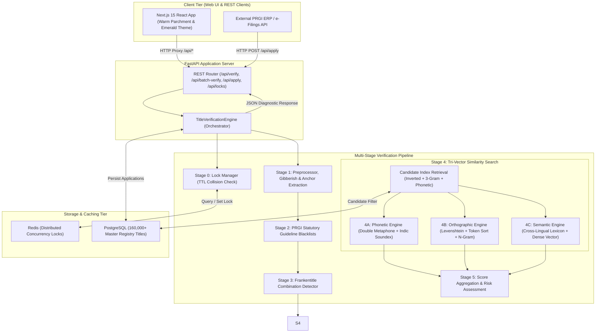

# 🏛️ Press Registrar General of India (PRGI) — Automated Title Verification System

[](https://nextjs.org/)
[](https://www.python.org/)
[](https://fastapi.tiangolo.com/)
[-success.svg)](https://pytest.org/)
[]()
[](https://www.docker.com/)
[]()

An enterprise-grade, high-performance automated title verification system built for the **Press Registrar General of India (PRGI)** under the Ministry of Information and Broadcasting (Govt. of India). The platform screens proposed newspaper and periodical titles against **160,000+ registered titles** and strictly enforces statutory PRGI guidelines, non-text symbols/math character prohibitions, numeric-only bans, gibberish & meaningless word detection, phonetics, orthography, deceptive combinations, cross-lingual translations, and application concurrency locks in **sub-10ms query latency**.

---

## 📑 Table of Contents

1. [Executive Summary & Problem Statement](#-executive-summary--problem-statement)
2. [Key Highlights & Performance Benchmarks](#-key-highlights--performance-benchmarks)
3. [System Architecture & Data Flow](#-system-architecture--data-flow)
4. [Complete Verification Flow (Stage-by-Stage Breakdown)](#-complete-verification-flow-stage-by-stage-breakdown)
   - [Stage 0: Application Lock & Concurrency Window](#stage-0-application-lock--concurrency-window)
   - [Stage 1: Pre-processing, Structural Validation & Gibberish Detection](#stage-1-pre-processing-structural-validation--gibberish-detection)
   - [Stage 2: PRGI Statutory Guideline Blacklists](#stage-2-prgi-statutory-guideline-blacklists)
   - [Stage 3: Frankentitle Combination Detection](#stage-3-frankentitle-combination-detection)
   - [Stage 4: Tri-Vector Multi-Dimensional Similarity Engine](#stage-4-tri-vector-multi-dimensional-similarity-engine)
     - [4A: Phonetic Engine (Double Metaphone + Indic Soundex)](#4a-phonetic-similarity-engine)
     - [4B: Orthographic Engine (Levenshtein + Token Sort + N-Gram Dice)](#4b-orthographic-similarity-engine)
     - [4C: Cross-Lingual Semantic Engine (Concept Lexicon + Embeddings)](#4c-cross-lingual-semantic-engine)
   - [Stage 5: Aggregation, Probability Calculation & Diagnostics](#stage-5-aggregation-probability-calculation--diagnostics)
5. [Technology Stack](#-technology-stack)
6. [Project Directory Layout](#-project-directory-layout)
7. [Installation & Getting Started](#-installation--getting-started)
   - [FastAPI Backend Setup](#fastapi-backend-setup)
   - [Next.js Frontend Setup](#nextjs-frontend-setup)
8. [API Reference & Endpoint Documentation](#-api-reference--endpoint-documentation)
9. [Running Test Suites & Diagnostic Benchmarks](#-running-test-suites--diagnostic-benchmarks)
10. [Next.js Visual Verification Studio](#-nextjs-visual-verification-studio)
11. [PRGI Statutory Rulebook Mapping](#-prgi-statutory-rulebook-mapping)

---

## 📌 Executive Summary & Problem Statement

Under the **Press and Registration of Periodicals Act, 2023 (PRP Act 2023)** and PRGI Title Allocation Guidelines, registering a publication title in India requires satisfying strict distinctiveness and non-deceptive resemblance criteria:

- **Deceptive Similarity:** A title cannot sound identical, look identical, or mean the same as any existing registered title in any Indian state or language.
- **Statutory Blacklists:** Words implying police, crime, state authority, judicial bodies, military, or violating the *Emblems and Names (Prevention of Improper Use) Act, 1950* are strictly prohibited.
- **Gibberish & Meaningless Words:** Titles composed of unpronounceable consonant clusters or low-entropy repetitive characters (e.g., `"zzzzzzz"`, `"asdfasdf"`, `"ghibrisg"`) are automatically rejected.
- **Pure Generic Combinations:** Titles composed purely of periodicities and generic words (e.g., *"The Daily News"*, *"Weekly Express India"*) lack distinctiveness and must be disallowed.
- **Frankentitle Combinations:** Joining two registered titles (e.g., *"The Hindu"* + *"The Indian Express"* $\rightarrow$ *"Hindu Indian Express"*) to mislead the public is strictly rejected.
- **Cross-Lingual Clones:** Direct translation of existing titles into regional Indian languages (e.g., *"Daily Evening"* vs *"Pratidin Sandhya"*, *"Morning News"* vs *"Prabhat Samachar"*) violates title uniqueness.
- **Concurrency & Race Conditions:** Multiple publishers applying for identical or similar titles at the same time are handled with Redis time-to-live (TTL) application locks to prevent race conditions.

---

## ⚡ Key Highlights & Performance Benchmarks

- ⚡ **Ultra-Fast Sub-10ms Latency:** Inverted token, character 3-gram, and phonetic hash indexes deliver candidate search across **160,000+ titles in ~5.55 ms**.
- 🧪 **100% Automated Test Pass Rate:** Unit, integration, and gibberish test suites passing in Pytest.
- 🔒 **Distributed Concurrency Locks:** Redis-backed distributed lock with millisecond-accurate TTL countdown and in-memory zero-dependency fallback.
- 🧠 **Shannon Character Entropy Gibberish Detector:** Automatically identifies meaningless word sequences using character transition probabilities and consonant cluster rules.
- 🌐 **Tri-Vector Similarity Engine:** Evaluates candidate titles across 3 orthogonal vectors: **Phonetic (Sound)**, **Orthographic (Spelling)**, and **Semantic (Meaning)**.
- 🎨 **Modern Next.js (React) UI Studio:** Custom warm parchment theme, semi-circular SVG probability speedometer gauge, 5-stage funnel visualizer, Redis lock simulator, and 160k+ registry browser.

---

## 🏗️ System Architecture & Data Flow



---

## 🔄 Complete Verification Flow (Stage-by-Stage Breakdown)

### Stage 0: Application Lock & Collision Check
- **Purpose:** Prevents race conditions when multiple applicants apply for identical or deceptively similar titles simultaneously.
- **Behavior:** Locks the title in Redis with a default 10-minute TTL (600s). Rejects concurrent attempts by other applicants with status `REJECTED_PENDING_COLLISION`.
- **Implementation:** [`backend/lock_manager.py`](file:///c:/sih_prgi2/prgi-title-verifier/backend/lock_manager.py)

---

### Stage 1: Pre-processing, Gibberish & Anchor Extraction
- **Prohibited Symbols Rule:** Blocks mathematical symbols (`+`, `*`, `@`, `#`), pictographs, logos, emojis (`REJECTED_PROHIBITED_SYMBOLS`).
- **Pure Numeric Rule:** Blocks titles consisting solely of digits (e.g., `"12345"`, `"2024"`).
- **Gibberish & Meaningless Word Detection:** Evaluates Shannon Character Entropy ($\le 1.5$), character N-gram transition probabilities, and consonant cluster limits ($\ge 5$ consecutive consonants) to flag unpronounceable strings (e.g. `"zzzzzzz"`, `"ghibrisg"`).
- **Anchor Extraction:** Strips generic periodicities (`Daily`, `Weekly`, `Samachar`, `News`) and extracts distinctive core anchor words.
- **Implementation:** [`backend/pipeline/stage1_preprocessor.py`](file:///c:/sih_prgi2/prgi-title-verifier/backend/pipeline/stage1_preprocessor.py) & [`backend/pipeline/gibberish_detector.py`](file:///c:/sih_prgi2/prgi-title-verifier/backend/pipeline/gibberish_detector.py)

---

### Stage 2: PRGI Statutory Guideline Blacklists
- **Guideline 12 (Law Enforcement & Crime):** Prohibits terms like *Police, Crime, CID, CBI, Army, Navy, Air Force, Vigilance, Investigation, Detective*.
- **Emblems & Names (Prevention of Improper Use) Act, 1950:** Prohibits *Ashoka Chakra, Rashtrapati, President, Prime Minister, National Emblem*.
- **Judicial & State Terms:** Prohibits *High Court, Supreme Court, Lok Sabha, Rajya Sabha, Sarkar, Government*.
- **Implementation:** [`backend/pipeline/stage2_guidelines.py`](file:///c:/sih_prgi2/prgi-title-verifier/backend/pipeline/stage2_guidelines.py)

---

### Stage 3: Frankentitle Combination Detection
- Detects compound titles formed by concatenating two existing registered titles (e.g., *"The Hindu"* + *"The Indian Express"* $\rightarrow$ *"Hindu Indian Express"*).
- **Implementation:** [`backend/pipeline/stage3_combinations.py`](file:///c:/sih_prgi2/prgi-title-verifier/backend/pipeline/stage3_combinations.py)

---

### Stage 4: Tri-Vector Multi-Dimensional Similarity Engine
- **4A: Phonetic Engine:** Double Metaphone & Indic-Soundex matching (e.g. *"Namascar India"* $\leftrightarrow$ *"Namaskar India"* $\rightarrow$ 100% Homophone Match).
- **4B: Orthographic Engine:** Levenshtein edit distance & Jaro-Winkler similarity (e.g. *"Hindustan Times"* $\leftrightarrow$ *"Hindustan Tymes"* $\rightarrow$ 97% Match).
- **4C: Cross-Lingual Semantic Engine:** Multilingual concept lexicons & sentence embeddings (e.g. *"Daily Evening"* $\leftrightarrow$ *"Pratidin Sandhya"* $\rightarrow$ 90%+ Semantic Match).
- **Implementation:** [`backend/pipeline/stage4_similarity.py`](file:///c:/sih_prgi2/prgi-title-verifier/backend/pipeline/stage4_similarity.py)

---

### Stage 5: Score Aggregation & Probability Calculation

$$\text{Verification Probability} = \max\Big(0,\; 100\% - \text{Highest Similarity Score}\Big)$$

| Highest Similarity | Verification Probability | Verification Status | Action |
| :--- | :--- | :--- | :--- |
| **$\ge 65\%$** | $\le 35\%$ | ❌ **Rejected** | Rejected due to deceptive similarity or guideline conflict. |
| **$45\% \le \text{Sim} < 65\%$** | $35\% < \text{Prob} \le 55\%$ | ⚠️ **Review Needed** | Flagged for manual PRGI officer review. |
| **$< 45\%$** | $> 55\%$ | ✅ **Approved** | Title satisfies distinctiveness criteria and is eligible for registration. |

---

## 💻 Technology Stack

| Layer | Technology |
| :--- | :--- |
| **Frontend UI** | Next.js 15 (React), Tailwind CSS, Lucide React Icons |
| **Backend Framework** | FastAPI (Python 3.12), Async Pydantic v2 |
| **Phonetics & Matching** | Double Metaphone, Indic-Soundex, RapidFuzz |
| **Frankentitle Engine** | Aho-Corasick Automaton & N-Gram Partition Decomposition |
| **Database & Cache** | PostgreSQL (B-Tree + Trigram `pg_trgm` indexes) & Redis TTL Locks |
| **Test Suite** | Pytest, Benchmarking Suite |

---

## 📁 Project Directory Layout

```
prgi-title-verifier/
├── backend/
│   ├── config.py                 # Application configuration & Redis parameters
│   ├── main.py                   # FastAPI application instance & REST endpoints
│   ├── lock_manager.py           # Redis concurrency lock manager with TTL
│   ├── pipeline/
│   │   ├── engine.py             # Unified 5-stage verification orchestrator
│   │   ├── gibberish_detector.py # Shannon Entropy & N-gram gibberish detector
│   │   ├── stage1_preprocessor.py# Text normalization & anchor extraction
│   │   ├── stage2_guidelines.py  # PRGI statutory blacklist rulebook
│   │   ├── stage3_combinations.py# Frankentitle compound title detector
│   │   └── stage4_similarity.py  # Tri-vector similarity core (Phonetic, Ortho, Semantic)
│   └── database/
│       ├── database.py           # SQLAlchemy database setup
│       └── titles_index.py       # PostgreSQL 160,000+ title search index
├── frontend-next/
│   ├── src/
│   │   ├── app/
│   │   │   ├── globals.css       # Custom warm parchment & emerald Tailwind tokens
│   │   │   ├── layout.js         # Root layout wrapper
│   │   │   └── page.js           # Main SPA tab controller
│   │   └── components/
│   │       ├── Header.jsx        # Ashoka emblem header & navigation pills
│   │       ├── VerificationStudio.jsx # Main verification studio & SVG speedometer gauge
│   │       ├── BatchScreening.jsx     # High-throughput bulk screening interface
│   │       ├── LockSimulator.jsx      # Redis concurrency lock collision simulator
│   │       ├── PRGIRulebook.jsx       # 18 statutory PRGI rules grid explorer
│   │       └── RegistryBrowser.jsx    # 160,000+ master registry search table
│   ├── next.config.mjs           # Next.js config with API proxy rewrites
│   └── package.json              # Node dependencies
├── tests/
│   ├── test_gibberish.py         # Shannon Entropy & Gibberish test suite
│   ├── test_pipeline.py          # Stage 1-5 pipeline test suite
│   └── test_api.py               # REST API endpoint integration tests
├── docker-compose.yml            # Multi-container production deployment manifest
├── Dockerfile                    # Containerization build file
├── requirements.txt              # Backend dependencies
└── README.md                     # Documentation manual
```

---

## 🚀 Installation & Getting Started

### Terminal 1: FastAPI Backend (Port 8000)
```powershell
cd c:\sih_prgi2\prgi-title-verifier
.\backend\venv\Scripts\Activate.ps1
uvicorn backend.main:app --host 127.0.0.1 --port 8000 --reload
```

### Terminal 2: Next.js Frontend (Port 3000)
```powershell
cd c:\sih_prgi2\prgi-title-verifier\frontend-next
npm run dev
```

Open **`http://localhost:3000`** in your browser. All API requests are proxied automatically to `http://127.0.0.1:8000`.

---

## 🔌 API Reference & Endpoint Documentation

- `POST /api/verify`: Run full 5-stage verification for a submitted title.
- `POST /api/batch-verify`: Bulk screen a batch list of candidate titles.
- `POST /api/apply`: Submit title application and acquire Redis TTL lock.
- `GET /api/locks`: List active pending application locks in Redis.
- `POST /api/locks/release`: Release an active pending title lock.
- `GET /api/titles/search`: Live search across 160,000+ registered titles database.
- `GET /api/guidelines`: Return PRGI guidelines catalog and disallowed words.
- `GET /api/health`: System health status and index stats.

---

## 🧪 Running Test Suites

```powershell
pytest tests/ -v
```

---

## 📄 License & Attribution

Developed for the **Press Registrar General of India (PRGI)**, Ministry of Information and Broadcasting, Government of India. Designed and implemented in compliance with the **Press and Registration of Periodicals Act, 2023**.
